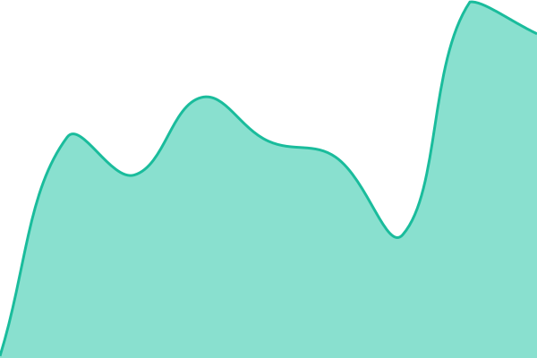
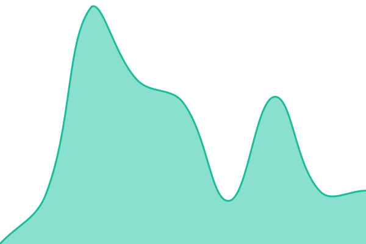
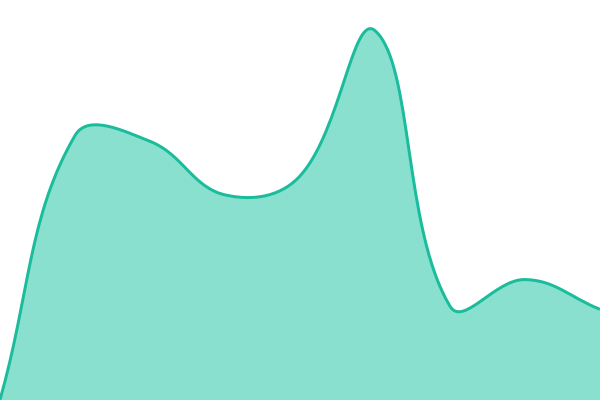
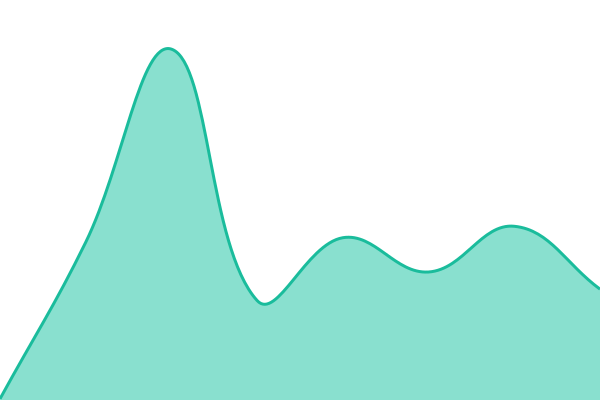
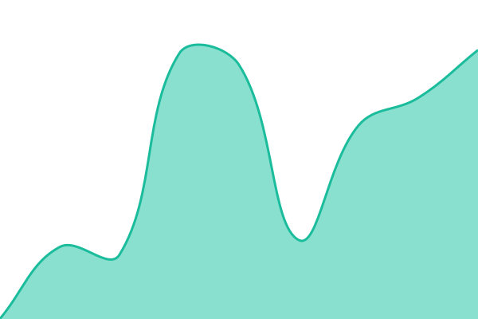
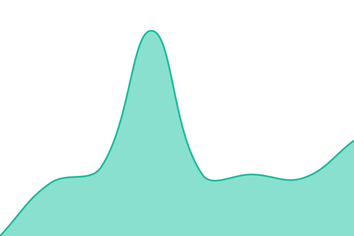

# [📈 Live Status](https://status.doslarb.cloud): <!--live status--> **🟩 All systems operational**

This repository contains the open-source uptime monitor and status page for [Doslarb](https://status.doslarb.cloud), powered by [Upptime](https://github.com/upptime/upptime).

With [Upptime](https://upptime.js.org), you can get your own unlimited and free uptime monitor and status page, powered entirely by a GitHub repository. We use [Issues](https://github.com/Doslarb/status/issues) as incident reports, [Actions](https://github.com/Doslarb/status/actions) as uptime monitors, and [Pages](https://status.doslarb.cloud) for the status page.

<!--start: status pages-->
<!-- This summary is generated by Upptime (https://github.com/upptime/upptime) -->
<!-- Do not edit this manually, your changes will be overwritten -->
<!-- prettier-ignore -->
| URL | Status | History | Response Time | Uptime |
| --- | ------ | ------- | ------------- | ------ |
|  [Landing](https://doslarb.cloud) | 🟩 Up | [landing.yml](https://github.com/Doslarb/status/commits/HEAD/history/landing.yml) | 

 114ms
     
 | 

<a href="https://status.doslarb.cloud/history/landing">100.00%</a>
    

|  [Pricing](https://doslarb.cloud/pricing) | 🟩 Up | [pricing.yml](https://github.com/Doslarb/status/commits/HEAD/history/pricing.yml) | 

 644ms
     
 | 

<a href="https://status.doslarb.cloud/history/pricing">100.00%</a>
    

|  [Docs](https://doslarb.cloud/docs) | 🟩 Up | [docs.yml](https://github.com/Doslarb/status/commits/HEAD/history/docs.yml) | 

 624ms
     
 | 

<a href="https://status.doslarb.cloud/history/docs">100.00%</a>
    

|  [Playground](https://doslarb.cloud/playground) | 🟩 Up | [playground.yml](https://github.com/Doslarb/status/commits/HEAD/history/playground.yml) | 

 712ms
     
 | 

<a href="https://status.doslarb.cloud/history/playground">100.00%</a>
    

|  [API Ping (auth)](https://doslarb.cloud/api/v1/ping) | 🟩 Up | [api-ping-auth.yml](https://github.com/Doslarb/status/commits/HEAD/history/api-ping-auth.yml) | 

 915ms
     
 | 

<a href="https://status.doslarb.cloud/history/api-ping-auth">100.00%</a>
    

|  [Internal Health](https://doslarb.cloud/api/internal/healthz) | 🟩 Up | [internal-health.yml](https://github.com/Doslarb/status/commits/HEAD/history/internal-health.yml) | 

 445ms
     
 | 

<a href="https://status.doslarb.cloud/history/internal-health">100.00%</a>
    

|  [Status Page Self-Check](https://status.doslarb.cloud) | 🟩 Up | [status-page-self-check.yml](https://github.com/Doslarb/status/commits/HEAD/history/status-page-self-check.yml) | 

 164ms
     
 | 

<a href="https://status.doslarb.cloud/history/status-page-self-check">100.00%</a>
    

|  [NAS Webhook 401 Contract](https://doslarb.cloud/api/internal/webhooks/nas/transaction) | 🟩 Up | [nas-webhook-401-contract.yml](https://github.com/Doslarb/status/commits/HEAD/history/nas-webhook-401-contract.yml) | 

 673ms
     
 | 

<a href="https://status.doslarb.cloud/history/nas-webhook-401-contract">100.00%</a>
    

|  [STT Engine Health](https://speech-to-text.doslarb.cloud/health) | 🟩 Up | [stt-engine-health.yml](https://github.com/Doslarb/status/commits/HEAD/history/stt-engine-health.yml) | 

 1085ms
     
 | 

<a href="https://status.doslarb.cloud/history/stt-engine-health">100.00%</a>
    

|  [TTS Engine Health](https://text-to-speech.doslarb.cloud/health) | 🟩 Up | [tts-engine-health.yml](https://github.com/Doslarb/status/commits/HEAD/history/tts-engine-health.yml) | 

 1148ms
     
 | 

<a href="https://status.doslarb.cloud/history/tts-engine-health">100.00%</a>
    

<!--end: status pages-->

[**Visit our status website →**](https://status.doslarb.cloud)

## 📄 License

- Powered by: [Upptime](https://github.com/upptime/upptime)
- Code: [MIT](./LICENSE) © [Anand Chowdhary](https://anandchowdhary.com)
- Data in the `./history` directory: [Open Database License](https://opendatacommons.org/licenses/odbl/1-0/)
